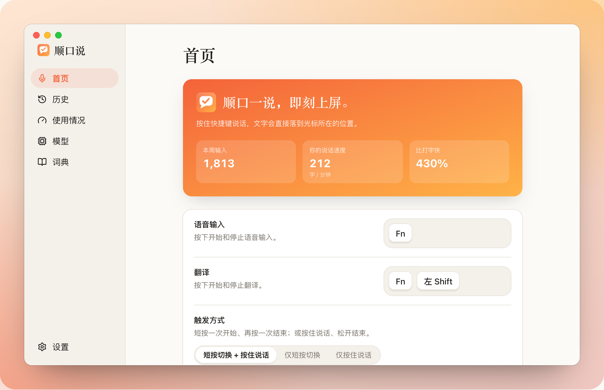
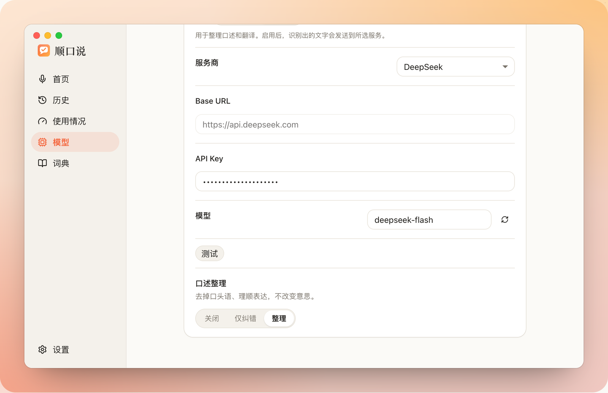
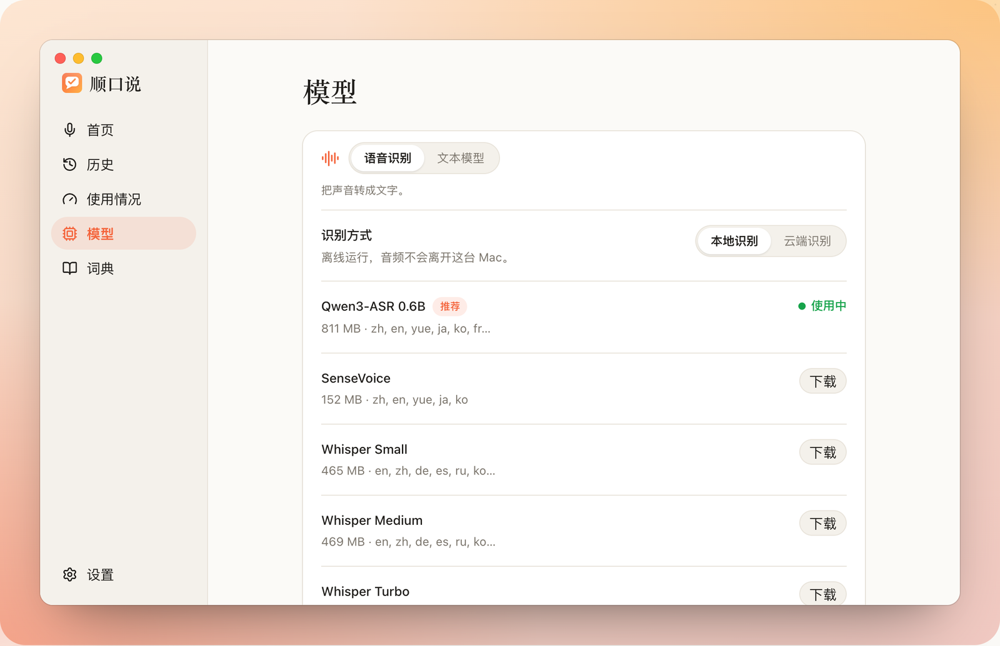
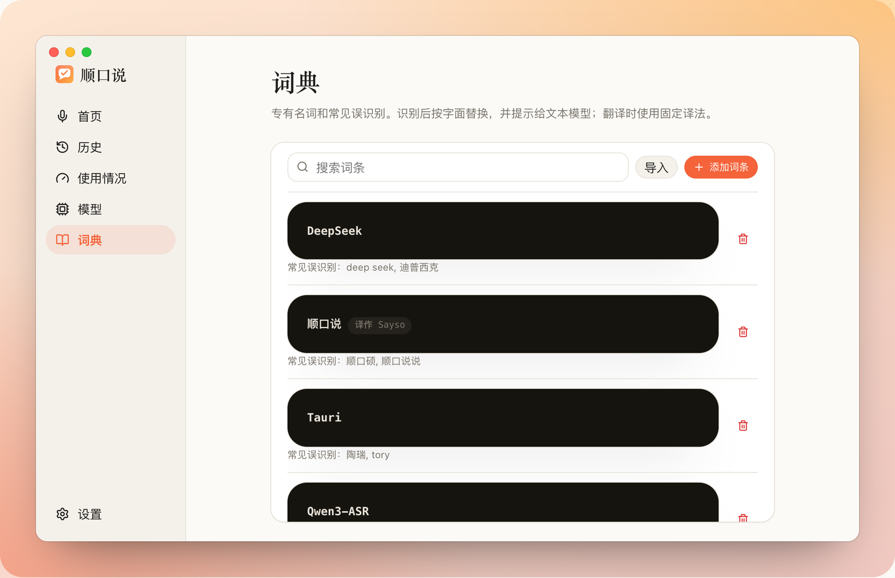
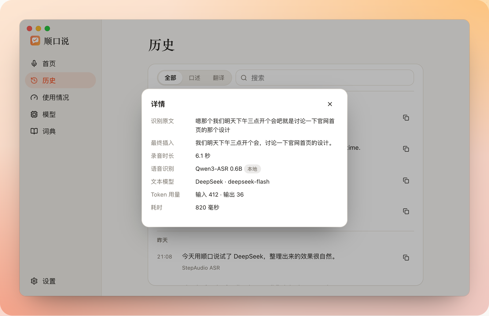
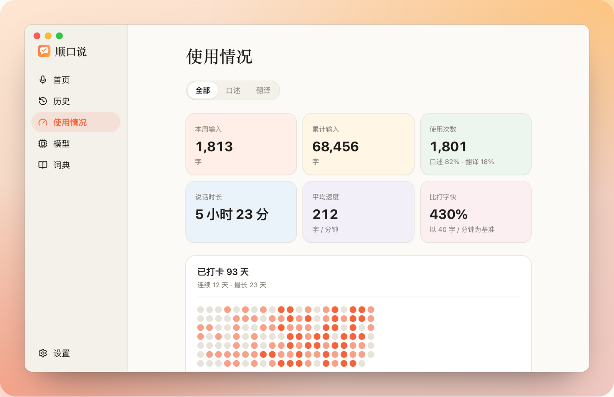
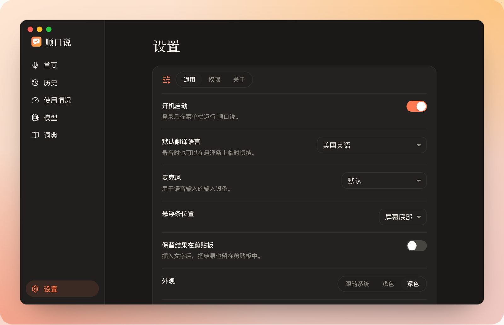

# Sayso · 顺口说

**English** | [简体中文](README.zh.md)

_Your say-so, on screen._

Local-first voice input for macOS. Hold Fn and talk, clean text lands at your cursor. Hold Fn + Left Shift and talk in Chinese, English comes out.

Website: [sayso-app.pages.dev](https://sayso-app.pages.dev) · Download: [latest release](https://github.com/zuijiaosy/sayso/releases/latest)

Forked from [Handy](https://github.com/cjpais/Handy) (MIT). Recording, global hotkeys, the non-activating overlay, reliable paste and model management come from there. Translation mode, text-model cleanup, the dictionary and cloud recognition are new.

<p align="center"></p>

<p align="center"><sub>Hold to talk → recognizing → cleaning up → the text lands at your cursor. Then Fn + Left Shift: speak Chinese, English comes out.</sub></p>

## Screenshots

<table>
  <tr>
    <td width="50%"><br><sub><b>Home</b>: Fn to dictate, Fn + Left Shift to translate, this week's numbers</sub></td>
    <td width="50%"><br><sub><b>Text model</b>: DeepSeek by default, any OpenAI-compatible endpoint; cleanup off / fix / polish</sub></td>
  </tr>
  <tr>
    <td width="50%"><br><sub><b>Speech recognition</b>: local Qwen3-ASR by default, or cloud providers</sub></td>
    <td width="50%"><br><sub><b>Dictionary</b>: preferred spellings, common misrecognitions, fixed translations</sub></td>
  </tr>
  <tr>
    <td width="50%"><br><sub><b>History</b>: raw transcript, inserted text, models used and token counts</sub></td>
    <td width="50%"><br><sub><b>Usage</b>: characters, speaking speed and a 20-week activity grid</sub></td>
  </tr>
  <tr>
    <td colspan="2"><br><sub><b>Settings</b>, dark mode: autostart, translation target, mic, overlay position</sub></td>
  </tr>
</table>

Every screen above can be clicked through in the browser: [try the app online](https://sayso-app.pages.dev/#try).

## Features

| Feature     | Notes                                                                                                                                                                                |
| ----------- | ------------------------------------------------------------------------------------------------------------------------------------------------------------------------------------ |
| Dictation   | `Fn`. Tap to start, tap to stop. Or hold to talk, release to finish.                                                                                                                 |
| Translation | `Fn + Left Shift`. Target language switches from the overlay. Hold Fn then add Left Shift to turn a running dictation into a translation.                                            |
| Overlay     | Black pill at the bottom of the screen: ✕ cancel, live waveform, ✓ done. Never takes focus from the field you are typing into.                                                       |
| Recognition | Local Qwen3-ASR 0.6B (offline, 30 languages, auto language detect). SenseVoice still available. Cloud: StepFun `stepaudio-2.5-asr`, Alibaba `qwen3-asr-flash`, Zhipu `glm-asr-2512`. |
| Text model  | DeepSeek `deepseek-flash` (thinking off), Alibaba Cloud, or any OpenAI-compatible endpoint.                                                                                          |
| Cleanup     | Off / fix only / polish (default).                                                                                                                                                   |
| Dictionary  | Preferred spellings, common misrecognitions, fixed translations, notes. Import and export as text.                                                                                   |

## Where your data goes

| Setup                       | Audio       | Text                                     |
| --------------------------- | ----------- | ---------------------------------------- |
| Local, cleanup off          | stays local | stays local                              |
| Local + DeepSeek or similar | stays local | transcript + matching dictionary entries |
| Cloud recognition           | uploaded    | depends on your text-model setting       |

- No silent cloud fallback. If local recognition fails, it fails.
- A failed translation never inserts the original. You get Retry and Copy original.
- A failed cleanup inserts the raw transcript, dictionary replacements included.
- API keys sit in plain text in `~/Library/Application Support/com.sayso.desktop/settings_store.json`. Keychain is on the list.

## Install

1. Build or download `Sayso.app`, drop it in Applications.
2. GitHub Actions builds are not notarized. Check the download came from this repo, then clear quarantine:

   ```bash
   xattr -cr /Applications/Sayso.app
   ```

3. Grant **Microphone**, **Accessibility** and **Input Monitoring** when asked.
4. System Settings → Keyboard → "Press 🌐 key to" → **Do Nothing**. Otherwise Fn also cycles input sources.
5. Pick recognition: download Qwen3-ASR 0.6B (~811 MB), import an existing sherpa-onnx SenseVoice int8 folder, or go cloud.
6. For cleanup or translation, add an API key under Models → Text model and hit Test.

### Updating

Settings → About → **Check for updates** opens the newest installer from GitHub; install it over the old copy. Every macOS build after 0.2.0 is signed with the same self-signed "Sayso Release" certificate, so an update keeps its Microphone, Accessibility and Input Monitoring grants (coming from 0.2.0 or earlier, grant them once more). Every push to `main` builds and publishes a new release automatically (`.github/workflows/release.yml`; the patch number counts up, `[skip release]` in the commit message skips it). Maintainers: the certificate lives in `~/.sayso-signing/`, never in the repo; local builds sign with `scripts/macos-signing.sh bun run tauri build`, and CI reads it from the `SAYSO_SIGNING_P12` / `SAYSO_SIGNING_P12_PASSWORD` secrets.

## License

MIT, see `LICENSE`. Third-party components and model weights: `THIRD_PARTY.md`.
